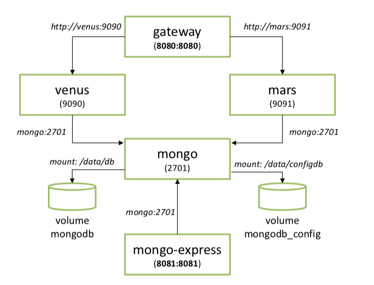
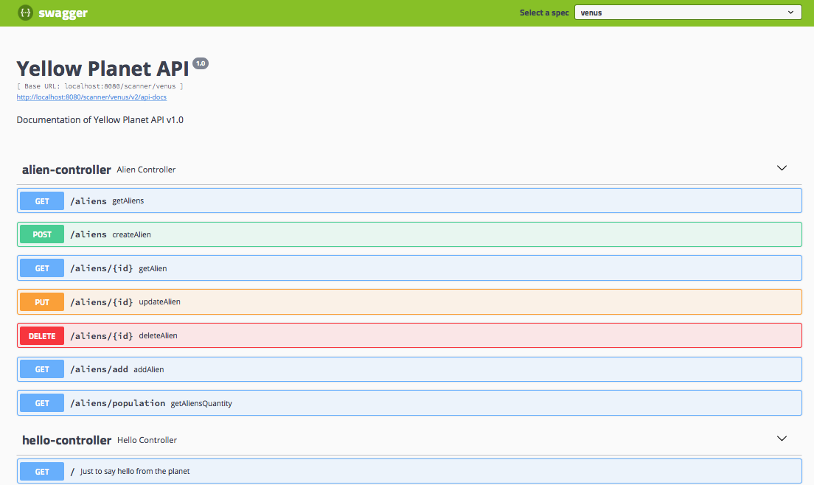
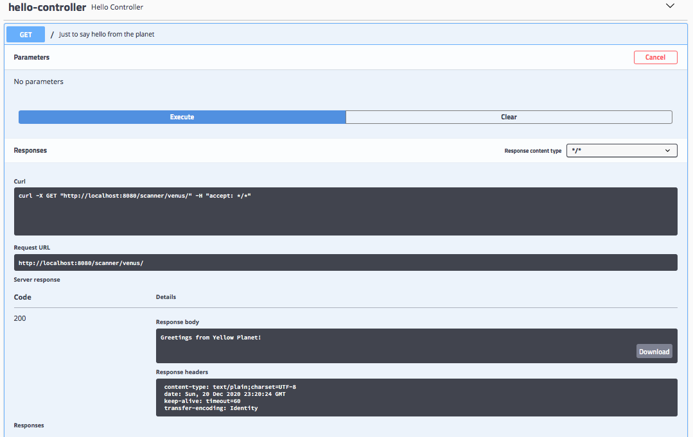

# Space Scanner

- Build di entrambi i progetti (alien, gateway): `./build-all.sh`
- Esecuzione di tutti i microservizi: `docker-compose up`
- Dashboard di mongo-express: [localhost:8081]()
- Space Scanner: [localhost:8080]()
	- Venus: [localhost:8080/scanner/venus]()
	- Mars: [localhost:8080/scanner/mars]()
	- Documentazione API (Swagger 2): [localhost:8080/swagger-ui.html]()

## Architettura

## Swagger UI
L'API Gateway aggregga la documentazione delle API sia di venus che di mars (selezionabile dal menu a tendina in alto a destra):

Si possono inoltre testare le API, come mostrato in questo esempio per `GET scanner/venus/`:
